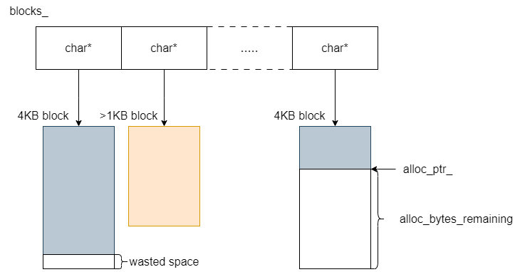
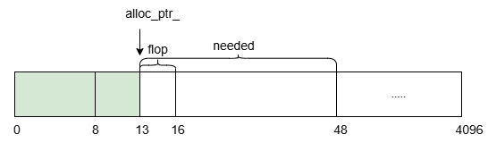

## Arena

Arena是一个用于KV数据内存分配的内存池。  

KV 数据内存分配存在的问题：  
1、KV 数据插入操作是比较频繁的操作，采用原始分配方式，如 new/delete 分配内存，会造成系统开销较大；  
2、KV 数据本身较小，如果在内存分配大量小内存数据，会造成大量的内存碎片，影响内存使用效率。   
  
因此需要一个内存池管理 KV 数据的内存分配。

### 内存池分析

#### 设计思路
1、先 new 申请一块较大的内存块，当分配小内存时，会在这块预留的内存块上分配剩余空间，若空间用完或不足分配，就会再申请一块；  
2、当分配较大内存时，直接使用 new 分配所需空间的内存并使用，不使用预留的块，这个主要是考虑到内存使用率问题。

#### 结构设计    
1、用一个 vector 数组保存所有分配的内存块地址（内存块默认大小为4KB）；   
2、用 alloc_ptr_ 指向当前内存块剩余空间的首地址；   
3、用 alloc_bytes_remaining_ 记录当前内存块剩余空闲空间大小。
```
// util/arena.h
class Arena {
 ...
 private：
  // Allocation state
  char* alloc_ptr_;
  size_t alloc_bytes_remaining_;

  // Array of new[] allocated memory blocks
  std::vector<char*> blocks_;

  // Bytes of memory in blocks allocated so far
  size_t blocks_memory_;
}
```
原理图示：



#### 内存分配策略
1、若所需内存小于当前内存块的剩余空间，由当前内存块分配，并移动内存指针，更改剩余大小；
2、若所需内存大于当前内存块的剩余空间，将会申请新的内存块；
```
// util/arena.h
inline char* Arena::Allocate(size_t bytes) {
  // The semantics of what to return are a bit messy if we allow
  // 0-byte allocations, so we disallow them here (we don't need
  // them for our internal use).
  assert(bytes > 0);
  if (bytes <= alloc_bytes_remaining_) {
    char* result = alloc_ptr_;
    alloc_ptr_ += bytes;
    alloc_bytes_remaining_ -= bytes;
    return result;
  }
  return AllocateFallback(bytes);
}
```
3、当申请新的内存块时，如果所需内存大于标准内存块的1/4（1KB），就申请非标准内存块，空间容量为用户所需大小，并独占整块内存，当前内存块指针不变；
4、否则，申请新的标准块（4KB），内存块指针指向新块，然后分配所需内存。
```
// util/arena.cc
// 分情况分配内存块
char* Arena::AllocateFallback(size_t bytes) {
  if (bytes > kBlockSize / 4) {
    // Object is more than a quarter of our block size.  Allocate it separately
    // to avoid wasting too much space in leftover bytes.
    char* result = AllocateNewBlock(bytes);
    return result;
  }

  // We waste the remaining space in the current block.
  alloc_ptr_ = AllocateNewBlock(kBlockSize);
  alloc_bytes_remaining_ = kBlockSize;

  char* result = alloc_ptr_;
  alloc_ptr_ += bytes;
  alloc_bytes_remaining_ -= bytes;
  return result;
}
```
以上是内存池分配内存的整个过程，其中只有 Allocate() 方法对用户开放，其他都是私有的，当需要分配内存时，只需调用Allocate()，其他工作由内存池负责完成。  

#### 内存对齐策略   
Arena 中还有一个特殊的分配内存的函数 AllocateAligned()，相比于原始的 Allocate()，增加了一个内存对齐操作。

**实现逻辑**   
1、按照指针大小对齐，限制最小对齐大小为 8B；   
2、通过取余操作，获取对齐分配时需要跳过的内存大小；  
3、所需内存需要加上跳过的内存大小。  
```
// util/arena.cc
char* Arena::AllocateAligned(size_t bytes) {
  const int align = (sizeof(void*) > 8) ? sizeof(void*) : 8;
  assert((align & (align-1)) == 0);   // Pointer size should be a power of 2
  // 使用了二次幂数取余的技巧
  size_t current_mod = reinterpret_cast<uintptr_t>(alloc_ptr_) & (align-1);
  size_t slop = (current_mod == 0 ? 0 : align - current_mod);
  size_t needed = bytes + slop;
  char* result;
  if (needed <= alloc_bytes_remaining_) {
    result = alloc_ptr_ + slop;
    alloc_ptr_ += needed;
    alloc_bytes_remaining_ -= needed;
  } else {
    // AllocateFallback always returned aligned memory
    result = AllocateFallback(bytes);
  }
  assert((reinterpret_cast<uintptr_t>(result) & (align-1)) == 0);
  return result;
}
```
假设地址为 0 的内存块需要分配 32B 内存，图示：



### 内存对齐   
指定一个对齐大小，当分配内存时，数据的地址与其必须满足倍数关系。
一般会按照指针大小（4B、8B）进行内存对齐，这主要是跟 CPU 缓存命中率和 CPU 寄存器运行效率有关。   

**与 CPU 缓存的关联**   
CPU 缓存内存数据时会按照缓存行大小进行地址对齐，CPU 缓存行常见大小为 32B、64B 或 128B。以 64B 为例，CPU 缓存内存数据时，内存的起始地址必须是 64 的整数倍，如 0、64、128 等地址。当数据在内存中按照指针大小对齐时，缓存行内存地址与数据地址有倍数关系，数据在缓存行中的分布更加合理，缓存行内的数据逻辑相关，从而提高缓存命中率，减少内存读取次数。   

**与 CPU 寄存器的关联**   
寄存器读取数据通常也是按照地址对齐的，数据的地址必须是寄存器大小的整数倍。多数情况下，指针大小和 CPU 寄存器大小通常是相同的。在 32 位系统中，指针和寄存器都是 4B；在 64 位系统中，指针和寄存器都是 8B。按照指针大小对齐内存，能让 CPU 在将数据从缓存加载到寄存器时，一次性完整地加载数据，充分利用寄存器的带宽，避免了因为数据未对齐而需要多次加载的情况，提高了数据处理的效率。   

### 小结
在 LevelDB 中，Arena 只用于 Memtable 底层 Skiplist 键值插入时的内存分配，其他场景如 SSTable、WAL 都需要比较大的内存，同时内存申请操作频次低，所以都不会用到。

### 参考文件
```
util/arena.h 
util/arena.cc
```
### PS
Q：**Arena内存分配不采用轮询内存块的方式，而是只使用当前内存块进行分配，也就是不管上一个内存块剩余多少，这样会不会造成内存浪费呢？**  

答案是肯定的，但是内存浪费的程度是可以接受的。
首先，leveldb的 KV 数据是没有删除操作的，只有插入操作，所有之前分配的内存不会回收再分配，浪费的内存只有内存块末尾的剩余空间；
其次，内存分配策略中，大于1KB 的内存会单独分配内存，同时 KV 一般都是内存比较小的数据，出现内存块剩余 990B，需要 991B 的情况的概率是比较小的，所以最后浪费的空间都是比较小的。

**编程技巧**    
- 禁止对象拷贝操作：可以将拷贝构造函数与拷贝赋值函数设置为私有（在 leveldb 源码中大量使用了这个用法）。
在C++11之后，可以使用=delete操作实现相同的效果。
  ```
  // util/arena.h
  class Arena {
  ...

  private:
    ...
    // No copying allowed
    Arena(const Arena&);
    void operator=(const Arena&);
  };
  ```
- 2次幂取余：数 m 对一个2次幂数 n 取余时，可以通过 m & (n-1) 进行快速取余，原理如下：   
以 8 为例，二进制是 1000，数 m 对 8 取余，余数为0~7，这个范围恰好对应 m 二进制数的后三位，因此当数 m 对 8 取余时，只需要计算 m & 111 取得后三位即可，同理，对任何2次幂数 n 取余，只需计算 m & (n-1)。