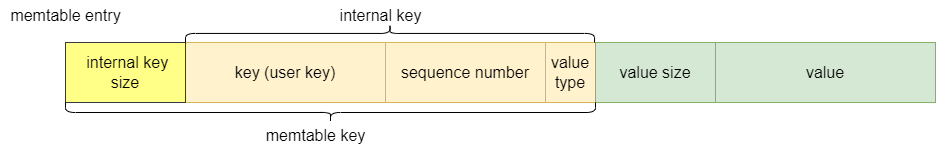

## Key

当用户使用 put(key, value) 操作向 LevelDB 插入数据时，并非直接在底层存储原始 key-value，而是要经过编码处理后存储于 memtable，这个过程中 key 有不同的含义。

### 分析
memtable 数据以 entry 为单位，每一条 entry 都由 key-value 经过前缀编码生成。   

1.&nbsp;三种类型的 key，分别都有不同的含义与使用场景。   
user key：用户提供的键，原始键，用户与数据库交互时使用；   
internal key：实际使用的键，数据库内部的键用此表示，作为数据的唯一标识；    
memtable key：底层存储的键，在 internal key 基础上加上了前缀长度，用于在 MemTable 中存取数据。

2.&nbsp;internal key    
序列号和值类型是一个 tag，每个 user key 都有一个 tag，组成 internal key。tag 一共占用8bytes，sequence number 占7bytes，value type 占1bytes。

**为什么需要对 user key 添加 tag 字段呢？**     
用户每次 put 数据时，数据库内部都会加入一个序列号，这个序列号是递增的，用于表示数据的新旧程度，对于同一个 user key，会有不同的序列号，序列号越大，表示 value 值越新。同时，为了区分出删除操作，加入了 type 字段，值为0时，表示 key 已删除，值为1时，表示 key 存在。
因此，每个 user key 都会跟着一个 tag 插入到 memtable 中。对相同 user key 进行更新/删除操作本质都是插入操作，一个 user key 可能对应着多个不同的 value。

**序列号作用**   
为数据添加序列号，可实现版本控制，保证并发下的数据一致性。
版本控制：默认情况下，get 操作会返回数据的最新版本，也就是序列号最大的 key-value。如果需要读取某一版本的数据，就要进行 snapshot 操作，通过指定一个序列号s，序列号小于等于 s 的数据可以被读取，序列号大于 s 的数据将被隔离，从而实现读取特定版本的数据。

**编码问题**   
sequence number 在数据库内部是一个无符号64位整数，即 8bytes 数据，而 internal key 中 sequence number 字段只有 7bytes，是不是有点矛盾？   
sequence number 本身是 8bytes 数据，但在数据编码时，为了节省空间，会进行（seq num << 8) | value type 操作，将 1bytes 留给 value type 使用，也就是sequence number 有效数据只有后 7bytes。

<!-- 3.&nbsp;mentable key -->

### 小结
internal key 是 LevelDB 内部的键，具有唯一性，对数据进行操作基本上都是使用 internal key，如迭代器访问，键的比较等。