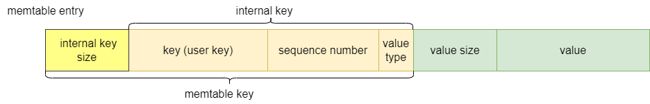

## Memtable
LevelDB 的数据分为内存数据和磁盘数据，内存数据是当前用户新增的数据，保存在 Memtable 中；磁盘数据是持久化数据，保存在 SSTable 中。Memtable 中的数据达到一定数量，就会持久化生成SSTable，最终保存在磁盘上。    

### 结构设计
**存储格式**   

    
key 解析可见：[Key存储分析](../Key_键值对存储/Key存储分析.md)

#### 内部成员
1、comparator_：KeyComparator 对象，内部封装了 InternalKeyComparator 比较器；   
2、refs_：Memtable 的引用计数，在释放 Memtable 时必须保证没有外部引用；   
3、arena_：内存池，提供高效的内存管理，用于分配 memtable entry 和跳表节点的内存；      
4、table_：跳表，作为 Memtable 的存储结构，用于存储 memtable entry。
```
// db/memtable.h
class Memtable {
  ...
  // 函数对象，通过 () 调用
  struct KeyComparator {
    const InternalKeyComparator comparator;
    explicit KeyComparator(const InternalKeyComparator& c) : comparator(c) { }
    // 调用 InternalKeyComparator
    int operator()(const char* a, const char* b) const;
  };

  // 示例化跳表模板，指定 entry 的类型为 const char*，comparator 类型为 KeyComparator
  typedef SkipList<const char*, KeyComparator> Table;

  KeyComparator comparator_;
  int refs_;
  Arena arena_;
  Table table_;
}
```
为什么已经有了 InternalKeyComparator，还需要 KeyComparator？   
因为跳表存储的是 memtable key，需要去除长度前缀获得 internal key，然后才可以传入 InternalKeyComparator 进行比较。
```
// db/memtable.cc
int MemTable::KeyComparator::operator()(const char* aptr, const char* bptr)
    const {
  // Internal keys are encoded as length-prefixed strings.
  // 去除长度前缀，获得 internal key
  Slice a = GetLengthPrefixedSlice(aptr);
  Slice b = GetLengthPrefixedSlice(bptr);
  return comparator.Compare(a, b);
}
``` 
从这里也可以看出不同 key 对应这不同的比较器：    
<user key, UserComparator>，<internal key, InternalKeyComparator>，<memtable key, KeyComparator>。    
Comparator 解析可见：[Comparator源码分析](../Comparator_比较器/Comparator源码分析.md)

#### 存储细节
**跳表节点**   
跳表的节点包括一个 key 和 next_ 指针数组，在 Memtable 实现上，key 的类型会被指定为 const char*，指向节点数据——entry；next_ 是每一层的指针，指向后继节点，默认只包含一个，即最低一层的指针，指针的数量等于节点高度，高度是一个随机值。
```
template<typename Key, class Comparator>
struct SkipList<Key,Comparator>::Node {
  explicit Node(const Key& k) : key(k) { }
  Key const key;
  ...
 private:
  // Array of length equal to the node height.  next_[0] is lowest level link.
  port::AtomicPointer next_[1];
}
```
**内存池**    
内存池使用内存对齐方式分配跳表节点，主要是考虑了缓存空间的局部性。    
常见的缓存行大小是 64B，以 64 位平台为例，缓存行可以缓存 8 个指针，足够容纳下大部分节点，因为节点最大高度限制为12，而达到这个高度的概率是很小的。因此采用内存对齐分配，节点内的指针很可能处于同一个缓存行内，当跳表在不同层级间跳转时，指针可以直接在缓存获取，这样就可以利用缓存的空间局部性提高访问效率。
```
// db/skiplist.h
// 分配一个新节点
template<typename Key, class Comparator>
typename SkipList<Key,Comparator>::Node*
SkipList<Key,Comparator>::NewNode(const Key& key, int height) {
  // 节点内存对齐，可以根据高度动态分配空间，next_ 可以按照数组的方式访问各级指针
  // 使用这种动态分配数组空间的方式，需要将声明在结构体的末尾
  // 由于 Node 已经包含最低一级指针，因此只需要再分配 height - 1 个指针空间
  char* mem = arena_->AllocateAligned(
      sizeof(Node) + sizeof(port::AtomicPointer) * (height - 1));
  return new (mem) Node(key);
}
```
内存池使用非对齐方式分配 entry，主要是考虑了内存利用率的问题。      
不使用对齐分配，可以充分利用每一个字节空间，避免因内存对齐形成内存间隙造成的内存浪费，尽可能多地存储 entry。这是通过牺牲内存对齐带来的访问效率，来换取内存利用率。   
另外一点，由于 key 和 value 都是大小不确定的字符串，要使用内存对齐的方式分配内存，需要进行更复杂的内存管理，这会提高代码的复杂度和维护成本，也会影响内存分配的效率。   
```
// db/memtable.cc
void MemTable::Add(SequenceNumber s, ValueType type,
                   const Slice& key,
                   const Slice& value) {
  ...
  // encoded_len 为 entry 字节长度
  char* buf = arena_.Allocate(encoded_len);
  ...
}
```
以上两种不同的内存分配方式，是在内存使用效率和系统性能之间进行权衡的结果。
### 读写操作
读写操作涉及的技术点在其他文章中都已经分析过。
#### 写操作
1、分配 entry 内存，将 user key 和 value 编码为 entry；   
2、根据 internal key 找到插入位置，生成新节点，新节点数据指针指向 entry，然后插入到跳表中。
```
// db/memtable.cc
void MemTable::Add(SequenceNumber s, ValueType type,
                   const Slice& key,
                   const Slice& value) {
  // user key size
  size_t key_size = key.size();
  // value size
  size_t val_size = value.size();
  // 8字节用于存放 seq num 和 type
  size_t internal_key_size = key_size + 8;
  // VarintLength() 会返回变长整数编码需要的字节数
  // encoded_len 为 entry 的大小
  const size_t encoded_len =
      VarintLength(internal_key_size) + internal_key_size +
      VarintLength(val_size) + val_size;
  // 内存池分配 entry 所需内存，返回内存首地址
  char* buf = arena_.Allocate(encoded_len);
  // 生成 entry，插入到跳表中：
  // 1. 使用变长整数编码，向 buf 中写入 internal key size
  char* p = EncodeVarint32(buf, internal_key_size);
  // 2. 向 buf 中写入 user key
  memcpy(p, key.data(), key_size);
  p += key_size;
  // 3. 向 buf 中写入 seq num 和 type
  EncodeFixed64(p, (s << 8) | type);
  p += 8;
  // 4. 使用变长整数编码，向 buf 中写入 value size
  p = EncodeVarint32(p, val_size);
  // 5. 向 buf 中写入 value，entry 生成完毕
  memcpy(p, value.data(), val_size);
  assert((p + val_size) - buf == encoded_len);
  // 6. 向跳表中插入 entry，内部生成新的节点并指向 entry
  table_.Insert(buf);
}
```
#### 读操作
```
// db/memtable.cc
bool MemTable::Get(const LookupKey& key, std::string* value, Status* s) {
  Slice memkey = key.memtable_key();
  Table::Iterator iter(&table_);
  // 使用跳表的迭代器进行查找
  iter.Seek(memkey.data());
  if (iter.Valid()) {
    // 返回的是第一个 >= internal key 的 entry 
    const char* entry = iter.key();
    uint32_t key_length;
    // 解码变长长度前缀，获得 internal key 的大小  
    const char* key_ptr = GetVarint32Ptr(entry, entry+5, &key_length);
    // 需要检查 internal key 的 user key 是否与用户传入的相同
    if (comparator_.comparator.user_comparator()->Compare(
            Slice(key_ptr, key_length - 8),
            key.user_key()) == 0) {
      // 如果 user key 正确，需要检查 tag 等于 kTypeDeletion 表示该 user key 已经删除。
      const uint64_t tag = DecodeFixed64(key_ptr + key_length - 8);
      switch (static_cast<ValueType>(tag & 0xff)) {
        case kTypeValue: {
          Slice v = GetLengthPrefixedSlice(key_ptr + key_length);
          value->assign(v.data(), v.size());
          return true;
        }
        case kTypeDeletion:
          *s = Status::NotFound(Slice());
          return true;
      }
    }
  }
  return false;
}
```
memtable 没有进行 seq num 的检查，因为跳表内部已经过滤掉序列号过大的值了。 
### 参考文件
```
db/memtable.h
db/memtable.cc
db/skiplist.h
```