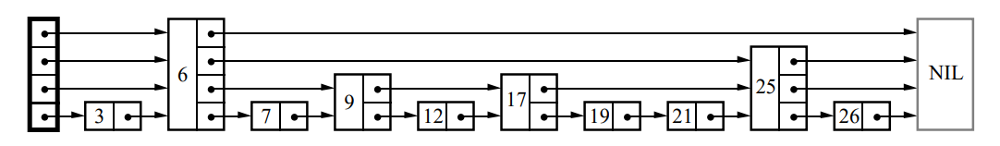

## Skiplist

跳表，作为 memtable 的存储结构，具有数据有序、存取高效等特点。它是基于概率的链表结构，在数据分布均匀的情况下，性能可以媲美平衡树（如红黑树），存取时间复杂度可达到 log(n)。在代码实现上也更加简单，可以较好地替代平衡树。    

这里对跳表原理不做过多解读，更多关注它在 LevelDB 中的应用细节。    

### 基本原理
    

跳表本质是一个链表结构，有三个基本的特点。      
1.&nbsp;**多级链表**
节点有多个 next 指针。节点有一个高度属性，高度代表 next 指针数量，每个 next 可以指向不同的后继节点，进而在逻辑上划分了不同的层级。越高的 next 指针一般会指向链表中越靠后的节点。

2.&nbsp;**随机高度**     
节点的高度一般都是随机生成的。理想情况下，假设节点数 n，跳表高度为 h，分支数为2，height >= 2 的节点数是 n / 2，height >= 3 的节点数是 n / 4，以此类推，height >= h 的节点数是 n / 2**(h-1)（2的h-1次幂），跳表高度 h = log(n) + 1。

3.&nbsp;定义分支

4.&nbsp;**查找规则**    
从最高一级开始查询，将目标值与当前节点的后继节点进行比较，如果后继节点值大于目标值或者后继节点是空节点，移动到下一层级进行比较，否则，继续遍历后继节点。

以图示为例，查找数字12：
第四层级开始，当前为头节点，后继节点 6 < 12，遍历6节点；
后继节点为空，移动到下一层级；
第三层级，后继节点为 25 > 12 ，移动到下一层级；
第二层级，后继节点为 9 < 12，遍历9节点；
后继节点为 17 > 12， 移动到下一层级；
后继节点为 12 == 12，找到目标值。

**效果**
可以看到，跳表每次向下层移动时都会跳过一定数量的节点，这就是跳表加快查询速度的原因。      
分支数为2时，最好的效果就是每次跳过一半的节点。

**时间复杂度**
跳表的时间复杂度取决于高度，而节点高度具有随机性，理想情况下将会是 log(n)，所以跳表的性能取决于随机函数的数据分布是否足够均匀。

### 内部实现
这里会删除一些逻辑无关的代码，如模板相关的代码。    

1.&nbsp;实现随机高度
```
// db/skiplist.h
int SkipList::RandomHeight() {
  // Increase height with probability 1 in kBranching
  static const unsigned int kBranching = 4;
  int height = 1;
  while (height < kMaxHeight && ((rnd_.Next() % kBranching) == 0)) {
    height++;
  }
  ...
  return height;
}
```
LevelDB 内部跳表是4分支的。     
还是以2分支为例。
2.&nbsp;实现查找
```

Node* SkipList::FindGreaterOrEqual(const Key& key, Node** prev) const {
  Node* x = head_;
  int level = GetMaxHeight() - 1;
  while (true) {
    Node* next = x->Next(level);
    if (KeyIsAfterNode(key, next)) {
      // Keep searching in this list
      x = next;
    } else {
      if (prev != NULL) prev[level] = x;
      if (level == 0) {
        return next;
      } else {
        // Switch to next list
        level--;
      }
    }
  }
}

bool SkipList::KeyIsAfterNode(const Key& key, Node* n) const {
  // NULL n is considered infinite
  return (n != NULL) && (compare_(n->key, key) < 0);
}
```
会找到满足 >=key 的第一个节点。

为什么不直接找到相等的节点呢？

### 源码
```
db/skiplist.h
```


### 小结
不管是数据的查询还是插入，跳表都是比较高效的，在高并发的场景下，会有展现出较好的性能。

### PS