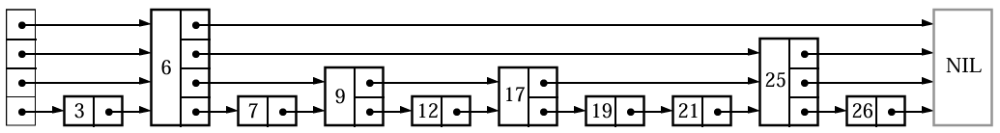
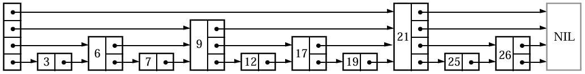
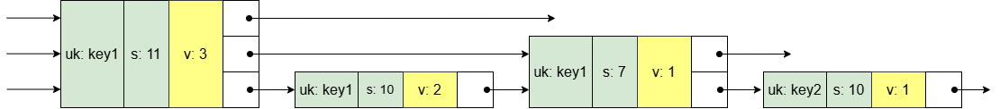

## Skiplist

跳表，作为 Memtable 的存储结构，具有数据有序、存取高效等特点。它是基于概率的链表结构，在随机数据分布均匀的情况下，性能可以媲美平衡树（如红黑树），存取时间复杂度可达到 O(log n)。在代码实现上也更加简单，可以较好地替代平衡树。      

### 基本原理
 
<center>图1：跳表实际分布</center>

#### 多级链表
跳表本质是一个链表结构，节点有多个 next 指针。节点有一个高度属性，高度等于 next 指针数量，每个 next 可以指向不同的后继节点，进而在逻辑上划分了不同的层级，高度为k 的节点称为 k级节点。       
在链表中会加入一个头节点，只用于表示链头，不会存值。

#### 数据有序
节点按值大小进行升序/降序排序。   

**查找规则**    
从最高一级开始查询，将目标值与当前节点的后继节点进行比较，如果后继节点值大于等于目标值或者后继节点为空，会先移动到下一层级，然后再进行比较，否则，继续向前遍历后继节点，直到无法向下移动结束。    

**一个查找示例**   
在图1 跳表中，查找数字12：  
从第四层级（最高一级）开始，当前为头节点，后继节点 6 < 12 ，遍历节点6；  
节点6 后继节点为空，移动到下一层级；  
在第三层级，后继节点 25 > 12，移动到下一层级；  
在第二层级，后继节点 9 < 12，遍历到节点 9；   
在第二层级，后继节点 17 > 12， 移动到下一层级；   
在第一层级，后继节点 12 >= 12，已经在最低一层，检查后继节点的值，等于12，查找成功。  

**插入规则**    
节点在插入时，先通过查找规则找到合适的插入位置，然后更新每一层级前任节点和自身的 next 指针。  

**一个插入示例**   
在图1 跳表中，插入高度为3，值为11的节点：   
先找到插入位置，在节点9 和节点12 之间；  
高度是3，需要更新三个层级的 next 指针；   
在第三层级，前任节点是节点6，将节点6 的 next 指针指向新节点11，新节点11 指向原来节点6 的后继节点25；   
在第二和第一层级，前任节点都是节点9，同理更改层级 next 即可。   

#### 定义分支
跳表有一个分支属性，可以表现出二叉/多叉树的效果。    


<center>图2：跳表理想分布</center>

**类比二叉树**    
以平衡二叉树为例，查询元素时，每次比较可以跳过一半节点。为了实现同样的效果，跳表设置分支数为2，每上升一个层级，节点的数量将减少一半，同时达到相同层级的节点呈现均匀分布，如图2所示（即每隔两个节点，有一个 height >= 2 的节点，每隔四个节点，有一个 height >= 3 的节点，以此类推）。通过这种机制，跳表每次比较也可以跳过一半节点，表现出二叉树的性质。     

**时间复杂度**     
假设跳表节点数为 n，跳表高度为 H，分支数为2，那么 height >= 2 的节点数是 n / 2，height >= 3 的节点数是 n / 4，以此类推，height >= H 的节点数是 1 = n / 2<sup>H-1</sup>，跳表高度 H = log<sub>2</sub>n + 1。    
从图2可以看出，跳表的查找次数等于 H * k（每一层移动的次数，可以当作一个常数），所以时间复杂度表示为 O(klog n)，而 k 是常数， 最终表示为 O(log n)，这跟平衡二叉/多叉树是一致的。      

**节点分布**   
节点分布规律：分支为2 时，对于达到层级 i 的节点，其中有一半会达到层级 i+1，很显然，不同层级节点分布满足：层级1 占比50%，层级2 占比25%，层级3 占比12.5%，依次类推。   
**注：** 节点高度h 代表节点所处的层级k，而达到层级k 的节点是满足 h >= k 的所有节点。    

#### 随机机制
对于图2 中跳表的节点分布是理想情况下的实现，实际的节点分布如图1 所示。    

**实现上的权衡**   
由于跳表实际使用时，节点数通常是动态变化的，会不断有新节点插入或者旧节点删除。如果要保证每一层节点均匀分布，在每次插入或删除节点时，需要对跳表的结构进行大规模调整，以重新分配各个节点的高度，这会使得时间复杂度显著增加，影响写性能。
因此，在实现跳表结构时，节点的高度采用随机函数生成的方式，给定一个分支数 b，使得达到层级 i 的节点晋升到层级 i+1 的概率为 p = 1/b，即 P(h>=i) = 1/b<sup>i-1</sup>，那么生成 i 级节点的概率为 P(h=i) = P(h>=i) * (1-1/b) = (1-1/b) / b<sup>i-1</sup>。   

**概率分布**     
设跳表分支为2，晋升概率 p = 1/2，P(h=i) = 1/2<sup>i</sup>，那么各个层级节点的概率如下：    
P(h=1) = 1/2，   
P(h=2) = 1/4，   
...
P(h=k) = 1/2<sup>k-1</sup>。   
由概率分布可以看出，只要随机函数的数据分布是否足够均匀，每一层级节点数可以满足节点分布规律，呈现出二叉树的性质。也就是说，随机的跳表结构平均性能是可以保证的，复杂度可以接近理想情况 O(log N)。   

**概率选择影响**    
节点高度的晋升概率p 会直接影响跳表的高度分布。当概率较高时，会有更多节点具有较高的高度，跳表的整体高度会增加，虽然这样在查找时可能会更快地跨越多个节点，但指针会占用更多的存储空间；当概率较低时，跳表的整体高度会相对较低，指针空间占用减少，但查找时可能需要遍历更多的节点，时间复杂度会增加。

#### 高度限制
**合理性**   
1、为了节省内存空间和维持良好性能，实际跳表的高度不会无限增长。如果当前节点数量较少，高度过高不但起不到加快查询速度的作用，反而还会影响查询速度，同时还会浪费内存空间。比如现在节点数 n 为1024，那么跳表的理想高度是 log<sub>2</sub>n = 10，然而节点的高度是随机的，因此会有部分节点的高度超过10，随着 n 的增大，这种过高节点会更多，过高的高度增加查询的比较次数，导致跳表性能下降，因此过高高度分配的指针空间也是无效的。   
2、限制最大高度，还可以简化代码实现，分配固定大小的数组来存储不同层的指针，而不需要动态地分配和管理无限增长的空间。     

**最大高度选择**    
对于最大高度的设置，需要根据对数据的规模进行评估后决定，规模较大就选择较大的值。   

#### 运行效果
跳表每次查找都会跳过一定数量的节点，这就是跳表加快查询速度的原因。在分支数为2 时，最理想的效果就是每次跳过一半的节点。

### 内部实现
skiplist 是 Memtable 的底层存储结构，用于存储 memtable key；   
这里会删除一些逻辑无关的代码，如模板相关的代码。    

#### 结构
1、kMaxHeight 最大高度设置为12，理想节点数为4096，这跟 Memtable 的大小有关；        
2、compare_ 是 KeyComparator 对象，内部封装了一个 InternalKeyComparator 对象；  
3、arena_ 内存池用于分配节点内存；  
4、head_ 指向跳表头节点；  
5、rnd_ 生成均匀分布的随机数。  
```
class SkipList {
  ...
private:
  enum { kMaxHeight = 12 };
  // Immutable after construction
  Comparator const compare_;
  Arena* const arena_;    // Arena used for allocations of nodes
  Node* const head_;
  // Read/written only by Insert().
  Random rnd_;
}
```
#### 随机高度方法
levelDB 选择晋升概率 1/4 而不是 1/2，是为了在时间复杂度和空间复杂度之间找到一个较好的平衡点。与常用的概率 1/2 相比，1/4 的概率会使跳表的高度增长更慢，往上晋升的节点也更少，从而减少空间开销，同时仍能保持相对较低的查找时间复杂度。理想情况下，概率为 1/4 时，跳表的高度为 log<sub>4</sub>n，而概率为 1/2 时高度为 log<sub>2</sub>n。显然，随着数据量的增加，log<sub>4</sub>n 增长更慢，空间占用更少。
```
// db/skiplist.h
int SkipList::RandomHeight() {
  // Increase height with probability 1 in kBranching
  static const unsigned int kBranching = 4;
  int height = 1;
  // 分支为4，晋升概率为1/4，P(h=k) = 3/(4**k)
  while (height < kMaxHeight && ((rnd_.Next() % kBranching) == 0)) {
    height++;
  }
  assert(height > 0);
  assert(height <= kMaxHeight);
  return height;
}
```
#### 查找方法
查找规则如上所述，跳跃式遍历节点，会找到满足 >=key 的第一个节点。
```
Node* SkipList::FindGreaterOrEqual(const Key& key, Node** prev) const {
  Node* x = head_;
  // 获取跳表当前高度，这里的层级是从 0 开始，所以高度与最大层级相差 1。
  int level = GetMaxHeight() - 1;
  while (true) {
    // 在当前层级，获得当前节点 x 的后继节点
    Node* next = x->Next(level);
    // 目标值 key 与后继节点值 next-> key进行比较
    if (KeyIsAfterNode(key, next)) {
      // 如果 key > next->key or next is NULL，遍历后继节点
      x = next;
    } else {
      // 可以记录每一层级的前任节点，用于插入节点时使用
      if (prev != NULL) prev[level] = x;
      if (level == 0) {
        // 已经到达最低一层，返回当前后继节点，显然是第一个 >= key 的节点
        return next;
      } else {
        // 移动到下一层级
        level--;
      }
    }
  }
}
```
key 比较规则：   
1、NULL 表示无限大值，任意节点都会小于 NULL；    
2、比较 internal key。先比较 user key ，然后比较 seq num。（user key 升序排序（默认按字节大小），seq num 降序排序。）   
```
// 判断 key 是否大于 next->key
bool SkipList::KeyIsAfterNode(const Key& key, Node* n) const {
  // NULL 必返回 false；
  // compare_ 重写了 operator()方法，内部调用了 InternalKeyComparator 进行 internal key 的比较
  return (n != NULL) && (compare_(n->key, key) < 0);
}
```

    
**注：** 上图只显示了 internal key 和 value，忽略了两者的前缀长度。     

如上图所示，现有一个跳表存储的结构片段示例，key1 插入了三个版本 {3, 2, 1}，key2 插入了一个版本 {1}，且 key2 > key1。由于序列号是降序排序，那么有 {uk: key1, s: 11} < {uk: key1, s: 10} < {uk: key1, s:7}。    

**序列号与读取操作**   
序列号的作用是实现快照隔离。序列号随时间递增，可以表示某一时刻用户读取数据时，数据所处的状态，也就是快照。在用户读取数据时，需要传入一个序列号，在这个序列号之后的更新将被隔离。
例：现在用户使用序列号 8，读取 key1 的值，跳表内部会找到第一个 >= {uk: key1, s: 8} 的节点，如果 key1 存在，那么会找到第一个 seq num <= 8 的节点，即 {uk: key1, s: 7, v: 1}，最终读取到的值为 1，在这之后的更新版本 {3, 2} 对用户来说是不可见的，用户只能读取到序列号8 之前的最新数据 1。        

### 源码
```
db/skiplist.h
```
### 小结
不论是数据的读操作还是写操作，跳表都是比较高效的，在 levelDB 较大规模的写频繁的场景下，跳表会比红黑树展现出更好的性能。

### PS
对于各层级节点概率的推理：   
由于节点从层级 i 上升到层级 i+1 的概率是1/b，容易得到 P(h>=i+1) = P(i>=i) * 1/b；   
已知 P(i>=1) = 1，递推可得 P(i>=i) = 1/b<sup>i-1</sup>；    
当达到层级 i 的节点留在层级i 时，便可以得到 i 级节点，上升的概率是1/b，那么留下的概率便是 1-1/b；    
而节点达到层级i 的概率是 P(i>=i)，可得 P(h=i) = P(h>=i) * (1-1/b)；
则高度概率分布 P(h=i) = (1-1/b)/b<sup>i-1</sup>。   

关于时间复杂度与晋升概率的关系        
后续补充。   

跳表论文链接：https://15721.courses.cs.cmu.edu/spring2018/papers/08-oltpindexes1/pugh-skiplists-cacm1990.pdf