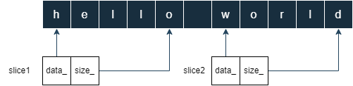

# Slice

Slice 是 LevelDB 中使用的字符串类型，用于内存中 key-value 的字符串表示，具有开销低、取值速度快等特点。

## 结构体设计
1.&nbsp;Slice 只有两个字段。   
- const char* data_ 是指向字符串的指针；  
- size_t size_ 是字符串的长度，标志字符串的结束；  
```
// include/leveldb/slice.h
class Slice {
 ...

 private:
  const char* data_;
  size_t size_;
}
```
2.&nbsp;Slice 本身不创建字符串。
从它的构造函数可以看出，data_ 指针是指向外部字符串的，可以是 string对象、char[ ]，或者默认为空。
```
// include/leveldb/slice.h
class Slice {
 public:
  // Create an empty slice.
  Slice() : data_(""), size_(0) { }

  // Create a slice that refers to d[0,n-1].
  Slice(const char* d, size_t n) : data_(d), size_(n) { }

  // Create a slice that refers to the contents of "s"
  Slice(const std::string& s) : data_(s.data()), size_(s.size()) { }

  // Create a slice that refers to s[0,strlen(s)-1]
  Slice(const char* s) : data_(s), size_(strlen(s)) { }
  
  ...
}
```
3.&nbsp;Slice本质就是对原始字符串的引用切片。
只需要通过指定首地址以及大小，就可以切出一个子串，而不需要对原子字符串进行拷贝操作，内存开销低、创建速度快，很高效。
```
const char* str = "hello world";
//切片操作 str[0:5) == "hello"
Slice s1(str, 5);
//切片操作 str[6:n) == "world"
Slice s2(str+6, 5);
```
示例图解：  



## 小结
结合以上特点，Slice 的引入避免了大量的字符串拷贝，提高了读取字符串的效率。   
在 Leveldb 的代码中，会涉及到大量读取内存字符串的操作，这些操作都会使用 Slice 来代替字符串，进行参数传递和返回，从而提高了数据库整体的性能。  

## 源代码
```
include/leveldb/slice.h
```

## PS：

**使用细节**    
1、在使用 Slice 时需要特别注意，必须保证传入的外部字符串，在 Slice 还指向它时，不能被销毁。如果被销毁将是危险的，因为 Slice 中的指针将成为野指针，其行为结果将是不确定的。    
2、由于不再需要 '\0' 作为字符串结束的标记，所以逻辑上讲字符串中是可以包含 '\0' 字符的。  