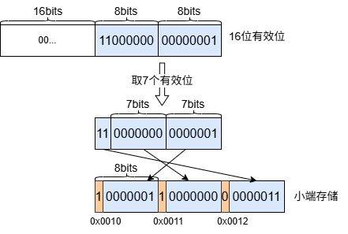
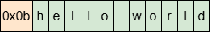

## Encode & Decode

**编码的必要性**    
不论是内存数据，还是磁盘数据，出于便捷性、效率、占用空间等方面考虑，在数据存取时，通常都需要对数据进行一定格式的编码；同时计算机又存在大端、小端不同的数据存储方式，为了保证数据存储的统一性，兼容不同平台，也需要对数据进行编码。

**大端存储与小端存储**     
一个多字节的数据，用逻辑表示时，从左到右，依次为高位到低位，如 0xaabbccff，最高位字节是aa，在代码数值或者书面表达中都采用这种方式。用内存表示时，数据高低位字节会有不同的存放顺序，形成大小端两种字节序，如下所示：  
大端模式，高位字节存储在低位地址（数字小为低地址）：
<table>
<tr>
    <th>数据</th>
    <td>aa</td>
    <td>bb</td>
    <td>cc</td>
    <td>ff</td>
</tr>
<tr>
    <th>地址</th>
    <td>0x0010</td>
    <td>0x0011</td>
    <td>0x0012</td>
    <td>0x0013</td>
</tr>
</table>
小端模式，低位字节存储在低位地址：
<table>
<tr>
    <th>数据</th>
    <td>ff</td>
    <td>cc</td>
    <td>bb</td>
    <td>aa</td>
</tr>
<tr>
    <th>地址</th>
    <td>0x0010</td>
    <td>0x0011</td>
    <td>0x0012</td>
    <td>0x0013</td>
</tr>
</table>

以上可以看出两种存储顺序是相反的。<b>在 leveldb 中统一都采用小端存储数据，也就是说如果平台采用的是大端模式，数据的编码操作会按小端模式进行编码，解码操作也会按小端模式解码。</b>

### 整数编码    
对于整数，有定长整数与变长整数两种编码方式，以下都以32位整数为例。

#### 定长整数    
平台是小端模式，直接复制即可；   
平台是大端模式，按照小端字节序存储数据。
```
// util/coding.cc
// fixed 32bit encode
void EncodeFixed32(char* buf, uint32_t value) {
  if (port::kLittleEndian) {
    memcpy(buf, &value, sizeof(value));
  } else {
    // 小端存储，低位字节存储在低地址
    buf[0] = value & 0xff;
    buf[1] = (value >> 8) & 0xff;
    buf[2] = (value >> 16) & 0xff;
    buf[3] = (value >> 24) & 0xff;
  }
}
```

#### 变长整数    
采用 1bit(标志位) + 7bit(数据) 格式进行编码。      
合理性：对于一个**无符号整数**，从二进制表示看，从左到右第一个非0位之后的所有位才是有效位，所以可以考虑只保留有效位，去除前导零，从而达到压缩存储空间的效果。    

**编码规则**     
标志位表示是否为最后一个字节，0表示最后一个字节，1表示其他字节；从无符号整数的二进制低位开始，每次取7个有效位，在最高位加标志位，凑成一个字节，最后一个字节不足7位补0，按照小端字节序存储。

```
// util/coding.cc
// 32bit encode
char* EncodeVarint32(char* dst, uint32_t v) {
  // Operate on characters as unsigneds
  unsigned char* ptr = reinterpret_cast<unsigned char*>(dst);
  // 设置最高位掩码，共8位，最高位为1，取余为0。
  static const int B = 128;
  if (v < (1<<7)) {
    *(ptr++) = v;
  } else if (v < (1<<14)) {
    // v 有8~14个有效位，第15位必为0。
    // 第一个字节：或运算，取低7位，最高位置1，放置在最低地址。
    *(ptr++) = v | B;
    // 最后一个字节：取第7~14，最高位置0，接着放置。
    // 这里的实际做法是直接取7~15位（一个字节），因为第15位必为0，刚好满足最高位0的要求，以下同理。
    *(ptr++) = v>>7;
  } else if (v < (1<<21)) {
    *(ptr++) = v | B;
    *(ptr++) = (v>>7) | B;
    *(ptr++) = v>>14;
  } else if (v < (1<<28)) {
    ...
  } else {
    ...
  }
  return reinterpret_cast<char*>(ptr);
}
```
以16位有效位的32位整数为例，编码如下：  



按照此种方式编码，32位整数将使用1-5个字节编码，而64位整数将使用1-10个字节编码。整数一般都用来表示字符串的长度，由于绝大部分字符串长度不会超过14个有效位，一个32位整数会被压缩到一个字节或两个字节。所以在大数据量下，节省的存储空间是非常可观的。

### 字符串编码   
采用长度前缀编码。     
在读取字符串时，需要知道其长度。因此在保存字符串数据时，会先采用变长整数编码对长度信息进行编码，然后置于字符串的前面。
```
// utils/coding.cc
// size 32bits
void PutLengthPrefixedSlice(std::string* dst, const Slice& value) {
  // 在字符串前编码长度
  PutVarint32(dst, value.size());
  dst->append(value.data(), value.size());
}

void PutVarint32(std::string* dst, uint32_t v) {
  char buf[5];
  char* ptr = EncodeVarint32(buf, v);
  dst->append(buf, ptr - buf);
}
```
对字符串 "hello world" 进行前缀长度编码，长度为11（0x0b），共 12 个字节，编码如下：   



### 小结
变长前缀的字符串编码，正是 Memtable 和 SSTable 中字符串的编码格式。 

### 参考文件
```
util/coding.h 
util/coding.cc
```